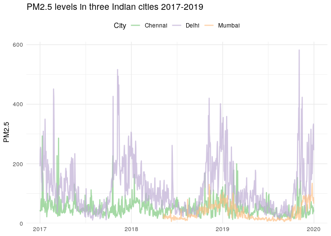
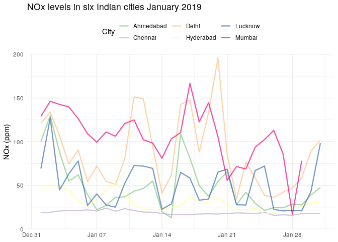

<!-- README.md is generated from README.Rmd. Please edit that file -->

<!-- You'll still need to render `README.Rmd` regularly, to keep `README.md` up-to-date. `devtools::build_readme()` is handy for this.  -->

# india.air

<!-- badges: start -->

<!-- badges: end -->

The goal of `india.air` is to make Indian air pollution data easily
available for analysis and visualization in R.

## Installation

The development version of XXX is available from
[GitHub](https://github.com/) with:

``` r
# install.packages("devtools")
devtools::install_github("Reed-Math241/pkgGrpr")
```

## Graphs

``` r
library(india.air)
library(tidyverse)
library(lubridate)
library(RColorBrewer)
library(viridis)
```




