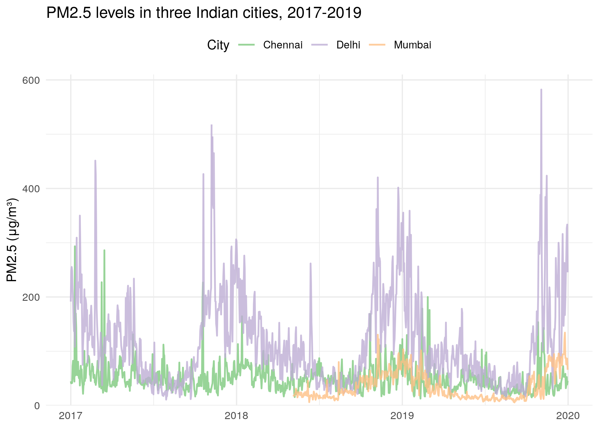
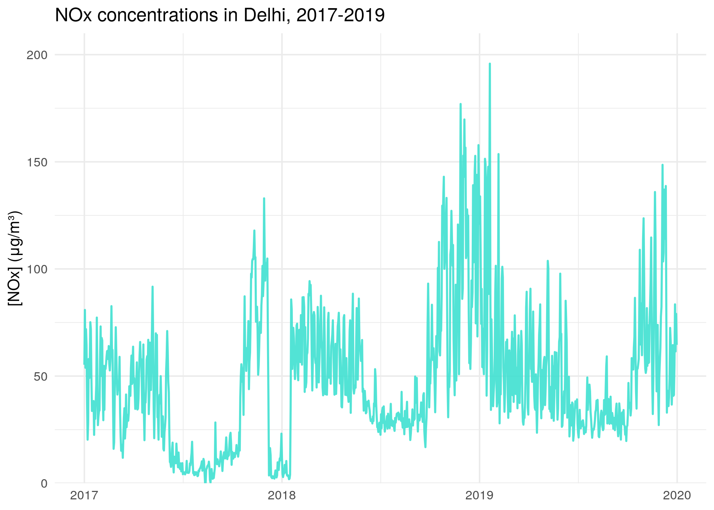
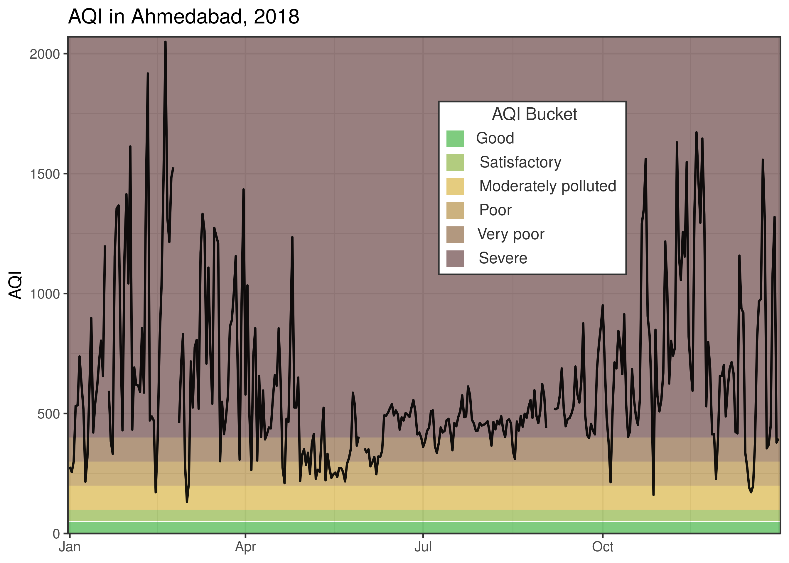
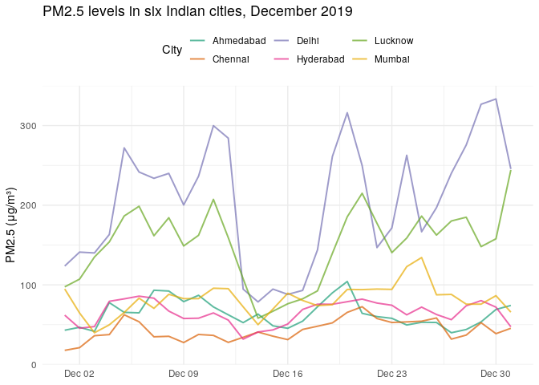

<!-- README.md is generated from README.Rmd. Please edit that file -->

<!-- You'll still need to render `README.Rmd` regularly, to keep `README.md` up-to-date. `devtools::build_readme()` is handy for this.  -->

# india.air

<!-- badges: start -->

<!-- badges: end -->

The goal of `india.air` is to make Indian air pollution data easily
available for analysis and visualization in R.



## Installation

The development version of `india.air` is available from
[GitHub](https://github.com/) with:

``` r
# install.packages("devtools")
devtools::install_github("Reed-Math241/india.air")
```

## About the data

This data was made available by the [Central Pollution Control Board of
India](https://cpcb.nic.in/) and compiled by [Vopani on
kaggle](https://www.kaggle.com/rohanrao/air-quality-data-in-india).

The data is within the public domain under the CC-0 license.

The package `india.air` contains one dataset, `india_air`. See
`?india_air` for a description of each of the variables.

``` r
head(india_air)
#> # A tibble: 6 x 14
#>   city      date       PM2.5    NO   NO2   NOx    CO   SO2    O3 benzene toluene
#>   <chr>     <date>     <dbl> <dbl> <dbl> <dbl> <dbl> <dbl> <dbl>   <dbl>   <dbl>
#> 1 Ahmedabad 2015-01-01    NA  0.92  18.2  17.2  0.92  27.6 133.     0       0.02
#> 2 Ahmedabad 2015-01-02    NA  0.97  15.7  16.5  0.97  24.6  34.1    3.68    5.5 
#> 3 Ahmedabad 2015-01-03    NA 17.4   19.3  29.7 17.4   29.1  30.7    6.8    16.4 
#> 4 Ahmedabad 2015-01-04    NA  1.7   18.5  18.0  1.7   18.6  36.1    4.43   10.1 
#> 5 Ahmedabad 2015-01-05    NA 22.1   21.4  37.8 22.1   39.3  39.3    7.01   18.9 
#> 6 Ahmedabad 2015-01-06    NA 45.4   38.5  81.5 45.4   45.8  46.5    5.42   10.8 
#> # … with 3 more variables: xylene <dbl>, AQI <dbl>, AQI_bucket <chr>
```

The dataset contains air pollution data for six Indian cities between
the years of 2015 and 2020 at the day level. Not all pollution
measurements were collected in each city on each date, so there is some
intrinsic missingness within the dataset.

## Examples

`india.air` is great for visualizing patterns in air pollution over
time. For example,





`india.air` is also great for comparing pollution among cities:



You can also easily produce summary stats of air pollution in India
using `india.air`:

``` r
#How many days in 2019 was each city's AQI higher than 100 (the maximum "satisfactory" AQI)?
india_air %>%
  filter(date >= mdy("1/1/2019") & date <= mdy("12/31/2019")) %>%
  group_by(city) %>%
  count(AQI > 100)
#> # A tibble: 12 x 3
#> # Groups:   city [6]
#>    city      `AQI > 100`     n
#>    <chr>     <lgl>       <int>
#>  1 Ahmedabad TRUE          352
#>  2 Ahmedabad NA             13
#>  3 Chennai   FALSE         218
#>  4 Chennai   TRUE          147
#>  5 Delhi     FALSE          43
#>  6 Delhi     TRUE          322
#>  7 Hyderabad FALSE         201
#>  8 Hyderabad TRUE          164
#>  9 Lucknow   FALSE          75
#> 10 Lucknow   TRUE          290
#> 11 Mumbai    FALSE         212
#> 12 Mumbai    TRUE          153

#What was the average Ozone concentration in each city in 2019?
india_air %>%
  filter(date >= mdy("1/1/2019") & date <= mdy("12/31/2019")) %>%
  group_by(city) %>%
  summarise(meanO3 = mean(O3, na.rm = TRUE))
#> # A tibble: 6 x 2
#>   city      meanO3
#> * <chr>      <dbl>
#> 1 Ahmedabad   46.6
#> 2 Chennai     35.2
#> 3 Delhi       38.9
#> 4 Hyderabad   29.0
#> 5 Lucknow     32.2
#> 6 Mumbai      28.9

#What was the average carbon monoxide concentration in each city in 2018?
india_air %>%
  filter(date >= mdy("1/1/2018") & date <= mdy("12/31/2018")) %>%
  group_by(city) %>%
  summarise(meanCO = mean(CO, na.rm = TRUE))
#> # A tibble: 6 x 2
#>   city      meanCO
#> * <chr>      <dbl>
#> 1 Ahmedabad 33.2  
#> 2 Chennai    0.870
#> 3 Delhi      1.41 
#> 4 Hyderabad  0.622
#> 5 Lucknow    1.04 
#> 6 Mumbai     1.57
```
