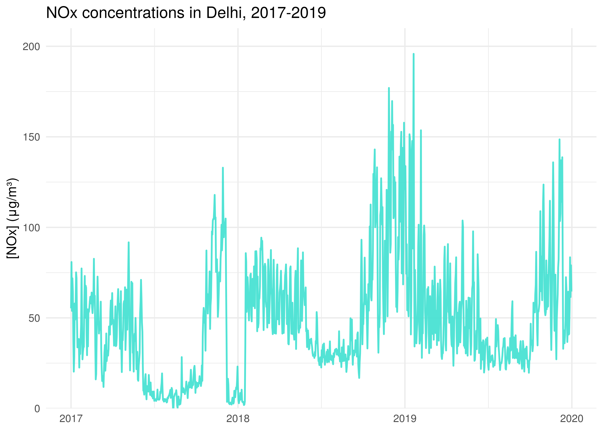

<!-- README.md is generated from README.Rmd. Please edit that file -->

<!-- You'll still need to render `README.Rmd` regularly, to keep `README.md` up-to-date. `devtools::build_readme()` is handy for this.  -->

# india.air

<!-- badges: start -->

<!-- badges: end -->

The goal of `india.air` is to make Indian air pollution data easily
available for analysis and visualization in R.


## Installation

The development version of `india.air` is available from
[GitHub](https://github.com/) with:

``` r
# install.packages("devtools")
devtools::install_github("Reed-Math241/pkgGrpr")
```

## About the data

``` r
head(india_air)
#> # A tibble: 6 x 14
#>   city  date       PM2.5    NO   NO2   NOx    CO   SO2    O3 benzene toluene
#>   <chr> <date>     <dbl> <dbl> <dbl> <dbl> <dbl> <dbl> <dbl>   <dbl>   <dbl>
#> 1 Ahme… 2015-01-01    NA  0.92  18.2  17.2  0.92  27.6 133.     0       0.02
#> 2 Ahme… 2015-01-02    NA  0.97  15.7  16.5  0.97  24.6  34.1    3.68    5.5 
#> 3 Ahme… 2015-01-03    NA 17.4   19.3  29.7 17.4   29.1  30.7    6.8    16.4 
#> 4 Ahme… 2015-01-04    NA  1.7   18.5  18.0  1.7   18.6  36.1    4.43   10.1 
#> 5 Ahme… 2015-01-05    NA 22.1   21.4  37.8 22.1   39.3  39.3    7.01   18.9 
#> 6 Ahme… 2015-01-06    NA 45.4   38.5  81.5 45.4   45.8  46.5    5.42   10.8 
#> # … with 3 more variables: xylene <dbl>, AQI <dbl>, AQI_bucket <chr>
```

This data was made available by the [Central Pollution Control Board of
India](https://cpcb.nic.in/) and compiled by [Vopani on
kaggle](https://www.kaggle.com/rohanrao/air-quality-data-in-india).

This data is within the public domain under the CC-0 license.

## Visualization Examples


